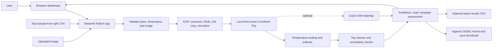
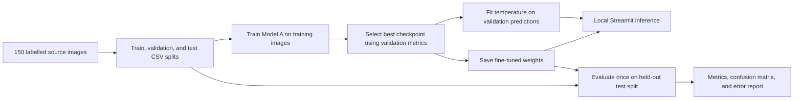

# 🛡️ ASTRA VISION — AI-Based Defence Object Recognition System

> **Challenge 02 · ASTRA Software Recruitment Challenge · BMSIT**
> Senior ML Engineering submission — CPU-first PyTorch implementation with Streamlit dashboard.

---

## 🎯 Project Overview

ASTRA VISION classifies military equipment imagery into one of **five defence categories**:

| Category | Label |
|---|---|
| Fighter Aircraft / Fixed-Wing Combat | ircraft |
| UAV / Drone | drone |
| Military Helicopter (Rotary-Wing) | helicopter |
| Armoured Vehicle / Main Battle Tank | military-vehicle |
| Naval Vessel / Warship | 
aval |

---

## 👨‍💻 My Contribution and AI Use

I built ASTRA VISION as an image-classification prototype for five categories of defence equipment. My project work brings together the Streamlit dashboard, image validation and preprocessing, model inference, uncertainty warnings, Grad-CAM visualizations, batch prediction with CSV export, prediction history, and evaluation reports.

### AI-Assisted Development

**GitHub Copilot** was used as a coding assistant to help inspect and explain the existing code, refine the Streamlit dashboard and its settings, and prepare technical documentation. Its role was development support: Copilot is not called by the application and does not classify images or generate prediction results.

### AI Used by the Application

The current dashboard uses **ConvNeXt-Tiny**, loaded from the Hugging Face checkpoint `facebook/convnext-tiny-224`. This vision model was pretrained on ImageNet and then fine-tuned for this project using 150 labelled Wikimedia Commons images across five categories. Training first adapts the five-class output layer, then fine-tunes the network's final feature stage. The saved Model A checkpoint is used for local predictions.

The app does **not** use a generative LLM such as ChatGPT at runtime. Its written prediction assessment comes from deterministic templates based on the predicted class and scores. Grad-CAM creates a feature-activation heatmap; it is a visual aid, not a natural-language explanation. CLIP Model B code and benchmark artifacts remain in the repository as experiments, but Model B is not selectable in the current dashboard.

### Engineering Decisions and System Flow

#### Runtime Components

| Layer | Technology and responsibility |
|---|---|
| Frontend | Streamlit renders the browser dashboard: image upload/sample selection, model settings, prediction visualizations, batch controls, history, metrics, and credits. The browser talks to the Streamlit Python server; there is no separately built JavaScript frontend. |
| Backend | Python 3.10+ runs the Streamlit app and the `defence_recog` modules in one application process. This keeps the demonstration simple to run and debug. |
| Image pipeline | Pillow and Torchvision validate and sanitize images, apply EXIF orientation, convert to RGB, resize/crop to 224 × 224, convert to tensors, and normalize using ImageNet statistics. |
| Active model | PyTorch and Hugging Face Transformers load the locally saved, fine-tuned ConvNeXt-Tiny checkpoint. Its five output scores are temperature-scaled, converted to probabilities, ranked, and checked against confidence and top-two margin thresholds. |
| Storage | There is no SQL or server database. Dataset labels/splits and evaluation reports are CSV; calibration settings are JSON; prediction history is append-only JSONL with JPEG thumbnails; model weights are local files. |
| Retrieval | The current classifier does not retrieve similar images. There is no embeddings index, vector database, or RAG pipeline. CLIP embedding caches remain only for the separate Model B experiment and are not used by the dashboard. |
| Explanations | A deterministic Python template produces the written assessment from the prediction scores. Grad-CAM generates a heatmap for Model A; neither feature uses a generative LLM. |
| Batch output | Batch uploads are classified one by one in the Python app, displayed as a table, and offered as a downloadable CSV. |

#### Runtime Flow



The input can be a user upload or a sample selected from the held-out test split. Validation rejects unreadable, undersized, or oversized images before model inference. The model runs on the device selected by configuration (CPU by default when no supported accelerator is available); prediction does not require sending the image to a hosted inference provider. A result includes the top class, confidence, top-three ranking, and uncertainty reasons when configured thresholds are not met. The Classify tab records predictions in local history; the Batch tab creates a downloadable CSV.

#### Offline Training and Evaluation Flow



The data contains 150 Wikimedia Commons images, balanced at 30 images per class. The configured split is 70% training, 15% validation, and 15% testing. Model A starts from ImageNet-pretrained ConvNeXt-Tiny weights: training first adjusts the new five-class output layer, then unfreezes the final feature stage while earlier layers remain fixed. Validation selects the best checkpoint and is also used for temperature calibration. The held-out test split is used for final evaluation, not weight updates.

#### APIs and External Services

- **Hugging Face Hub:** provides the original `facebook/convnext-tiny-224` pretrained checkpoint when the training setup needs to acquire it. The app uses the saved fine-tuned checkpoint locally; it does not call a hosted model inference API for each image.
- **Google Fonts:** the dashboard stylesheet imports fonts from Google Fonts, so the browser may contact that CDN to render the selected typefaces.
- **Optional YOLO mode:** the experimental multi-object checkbox uses Ultralytics YOLOv8n for generic object boxes, then sends crops to Model A. The detector weights must be available locally or downloaded by Ultralytics. This feature is optional and off by default.
- **No application REST API:** the project has no separately deployed backend API, authentication service, or cloud database. Streamlit handles browser interactions and Python inference directly.

#### Why This Architecture

- **Transfer learning instead of training from scratch:** 150 images is a small dataset. Starting from ImageNet-pretrained visual features and fine-tuning only part of the network reduces the amount of data and compute needed for a useful prototype.
- **One Python app instead of separate frontend and backend services:** Streamlit makes it practical to demonstrate upload, prediction, charts, and history without maintaining a second web stack or a custom API.
- **Local inference instead of a hosted inference API:** it avoids per-request service costs and keeps image prediction within the local app environment. The trade-off is that the checkpoint must be installed with the app, and CPU inference can be slower.
- **CSV and JSONL instead of a database:** the dataset and report artifacts are small and mostly static, and the demo’s history is a simple local append-only log. This avoids operating a database, but is not designed for concurrent users, durable cloud storage, or production-scale audit requirements.
- **No vector search or RAG:** the task is fixed-label image classification, not question answering over documents or nearest-image retrieval. A vector database would add complexity without serving the current workflow.
- **Template assessment instead of an LLM:** fixed templates make the text predictable and avoid an external text-generation dependency. The text summarizes model scores; it is not independent evidence about the image.
- **CPU-oriented local/Docker deployment:** the project can run without a GPU. A Dockerfile is provided, but no cloud deployment is configured; the Model A checkpoint must be copied into or mounted at the configured model path in the container.

#### Significant Problems and Solutions

**1. Model scores looked more certain than validation performance justified.**

- **Problem:** Neural-network softmax scores can be overconfident, so a high displayed percentage may not correspond to a similarly high chance of being correct.
- **Diagnosis:** I measured Expected Calibration Error (ECE) using Model A predictions on the 22-image validation split. Before calibration, ECE was **0.348**.
- **Solution:** I added a calibration step that fits one temperature value by minimizing validation negative log-likelihood, then applies that temperature to logits before the app calculates probabilities. The saved temperature is **0.05**.
- **Outcome and caveat:** Validation ECE decreased to **0.0226**. This adjusts confidence scores, not the model's underlying class ranking or accuracy. Because it was measured on only 22 validation images, the improvement needs confirmation on a larger independent dataset.

**2. The dashboard did not match the final Model A-only product scope.**

- **Problem:** The interface still offered Model B and showed Streamlit's built-in Deploy control, even though the intended demo was Model A only and deployment was managed separately.
- **Diagnosis:** I traced the classifier selector through predictor initialization and found related Model B text in the performance and About views. The Deploy control came from Streamlit's default toolbar, not from an ASTRA feature.
- **Solution:** I made Model A the only dashboard classifier, removed Model B references from the active dashboard views, and set Streamlit's toolbar mode to `minimal` in `.streamlit/config.toml`. The CLIP scripts and historical benchmark artifacts remain available but are not part of the app workflow.
- **Verification:** The updated page showed Model A as the active classifier without the Deploy control, and all **13 project tests passed**.

The reported Model A accuracy is **87.0% on a held-out test set of 23 images**. Those images are for evaluation, not training; the small test set means this score is an estimate rather than a guarantee of real-world performance.

## 🏆 Benchmark Results (Held-Out Test Set, N=23)

The CLIP rows below document retained comparison experiments; the current dashboard uses Model A only.

| Model | Architecture | Test Accuracy | Macro F1 | ECE | CPU Latency |
|---|---|---|---|---|---|
| **Model A** (ConvNeXt-Tiny Fine-Tuned) | ConvNeXt-Tiny ~28M | **87.0%** | 0.8632 | 0.1295 | 116ms |
| **Model B** (CLIP Linear Probe) | ViT-B/32 + LogReg | **87.0%** | 0.8659 | 0.1104 | **0.07ms** |
| Model B (CLIP Zero-Shot Baseline) | ViT-B/32 Zero-Shot | 87.0% | 0.8652 | 0.0923 | — |

**5-Fold CV** (CLIP Probe): **92.7% ± 4.9% Accuracy**, **Macro-F1 0.9251 ± 0.0498**
**Temperature Calibration** (Model A): ECE improved from **0.348 → 0.023** (T=0.05).

---

## 🚀 Quick Start

Install dependencies and launch the existing Model A dashboard:

```powershell
pip install -r requirements.txt
streamlit run app/streamlit_app.py
```

To retrain Model A, run `py -3 scripts/train.py` from the project root. The training and evaluation scripts are optional when using the included checkpoint and reports.

---

## 🧠 Architecture

- **Model A**: ConvNeXt-Tiny transfer learning in two stages: train the classification head, then fine-tune the final feature stage. Training uses label smoothing and a cosine learning-rate schedule.
- **Model B experiments**: CLIP ViT-B/32 zero-shot and logistic-probe comparisons are retained in benchmark artifacts, but are not available in the current dashboard.
- **Calibration**: Temperature scaling — ECE 0.348 → 0.023 (T=0.05).
- **Explainability**: Grad-CAM saliency maps via pytorch-grad-cam.

---

## 🖥️ Streamlit Dashboard

| Tab | Description |
|---|---|
| 🎯 Classify | Upload / select test sample, Grad-CAM, Top-K bar chart, explanations |
| 📦 Batch Process | Multi-image batch classification with CSV download |
| 🗃️ Audit History | Persistent gallery of past predictions with thumbnails |
| 📈 Model Performance | Model A metrics, confusion matrix, training curves, and test errors |
| ℹ️ About & Credits | Project overview, limitations, dataset attribution |

---

## ⚠️ Limitations

- Closed-set: system cannot reject OOD inputs. Certainty banners mitigate this.
- Dataset: ~30 images/class from Wikimedia Commons.
- Educational use only. Not for operational deployment.

---

## 📜 Dataset Attribution

All 150 images from **Wikimedia Commons** (CC BY-SA 4.0, CC BY 4.0, CC0 1.0, Public Domain).
See 
esource/credits.csv for full attribution.

*Built for the ASTRA Software Recruitment Challenge — Challenge 02.*
